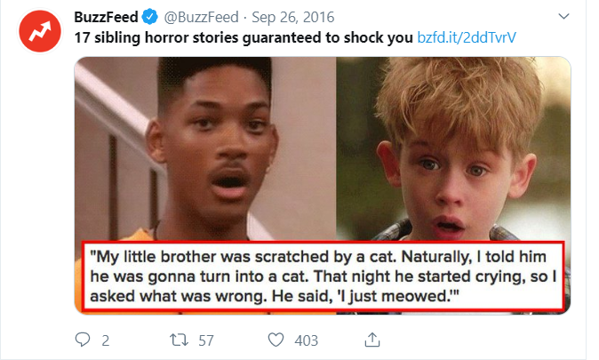
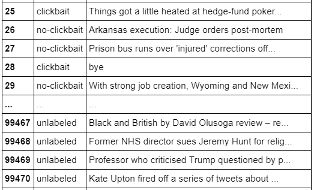
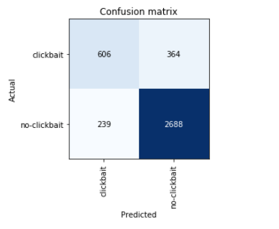
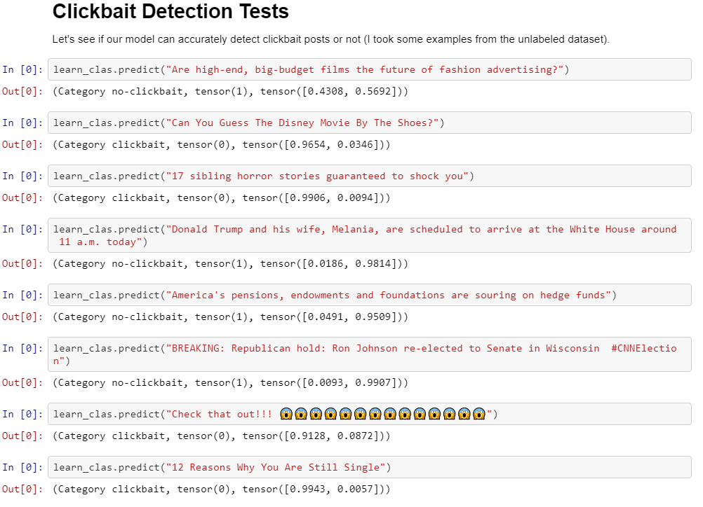

**Note:** In an [earlier repository](https://github.com/magicaltrap/clickbait_weka, "clickbait_weka"), I used [Weka](https://www.cs.waikato.ac.nz/ml/index.html "Weka Homepage") to create a Machine Learning Classification model. However, I was not too satisfied with the results, so I wanted to try a Deep Learning approach to get better results.

# About
We want to build a classifier which is able to detect clickbait posts on Twitter. We try to break the current state of the art accuracy (85.5%) for this dataset (spoiler: we come very close!). We will use fastai's library (which sits on top of PyTorch) to try out **transfer learning** for this classification task. Transfer learning has been used in the field of Computer Vision for quite some time now but just recently it is has been successfully applied to Natural Language Processing. More specifically, we will use fastai's **Universal Language Model Fine-tuning (ULMFiT)** approach for this task. 



# Clickbait Challenge Dataset
Download the Clickbait Challenge dataset [here](https://www.clickbait-challenge.org "Clickbait Challenge") (latest release date: June 30, 2017). The .zip file contains `instances.jsonl` and `truth.jsonl` that we need later. Also download the unlabeled .zip.file.

The Clickbait Challenge dataset provides a JSON file with labeled 19538 examples (Twitter posts linking a news article). This is an example Twitter post from the dataset: [Ban lifted on Madrid doping laboratory](https://twitter.com/bbcworld/status/858224473597779969?lang=en "Twitter Post") and in the JSON file it looks like this:

```
from instances.jsonl

{
 "id": "858224473597779969",
 "postTimestamp": "Sat Apr 29 07:40:34 +0000 2017",
 "postText": ["Ban lifted on Madrid doping laboratorys"],                     #Twitter post
 "postMedia": [""],                                                           #if the Twitter post has an image attached 
 "targetTitle": "World Anti-Doping Agency lifts ban on Madrid laboratory",    #actual article headline/article
 "targetDescription": "Madrid's Anti-Doping Laboratory has its...",           #description below a headline
 "targetKeywords": "",
 "targetParagraphs": [                                                        #article text. One sentence is one list element
 "Share this with", 
 "Madrid's Anti-Doping Laboratory has had its suspension lifted...", 
 "The laboratory was sanctioned in June 2016 after Wada said the Spanish...",
 ...],
 "targetCaptions": ["Samples in an anti-doping laboratory..."]                #photo captions in the article 
} 

```
To make it simple, we will only use the `postText` key from the dataset for now. This key contains the written text of a Twitter post.

# Requirements:

* PyTorch v1
* Python 3.6 or later
* `conda install -c pytorch -c fastai fastai`

Or simply run the notebook in Google Colaboratory (there is a Colab link in the two Jupyter Notebook) with this line to setup everything:
* `!curl -s https://course.fast.ai/setup/colab | bash`


# Steps

I took inspirations from these two fastai guides, check them out for more details: [fastai.text](https://docs.fast.ai/text.html, "fastai.text") and [fastai's NLP lesson 5](https://github.com/fastai/course-nlp/blob/master/5-nn-imdb.ipynb, "fastai NLP lesson 5").

## 1) Preprocessing
`preprocessing_csv.ipynb`

Download the labeled and unlabeled dataset from the Clickbait Challenge homepage. Run the `preprocessing_csv.ipynb` notebook to create CSV files for our classifier later. You will end up with 3 different  CSV files:
* CSV for the labeled data
* CSV for the unlabeled data
* CSV for the combined labeled/unlabeled data

We need the data in a specific format:



## 2) Language Model
`clickbait_detection.ipynb`

Download a pre-trained "AWD_LSTM" model [(Merity et al. 2017)](https://arxiv.org/abs/1708.02182, "AWD_LSTM") which is already trained on the big wikitext-103 dataset (100 million tokens). Fine-tune this model with our CSV files to adapt it to our clickbait task. 

## 3) Classifier
Create a classifier and we will use the encoder of our language model as the encoder of the overall clickbait architecture:

```
SequentialRNN(
  (0): AWD_LSTM(
    (encoder): Embedding(19000, 400, padding_idx=1)
    (encoder_dp): EmbeddingDropout(
      (emb): Embedding(19000, 400, padding_idx=1)
    )
    (rnns): ModuleList(
      (0): WeightDropout(
        (module): LSTM(400, 1152, batch_first=True)
      )
      (1): WeightDropout(
        (module): LSTM(1152, 1152, batch_first=True)
      )
      (2): WeightDropout(
        (module): LSTM(1152, 400, batch_first=True)
      )
    )
    (input_dp): RNNDropout()
    (hidden_dps): ModuleList(
      (0): RNNDropout()
      (1): RNNDropout()
      (2): RNNDropout()
    )
  )
  (1): LinearDecoder(
    (decoder): Linear(in_features=400, out_features=19000, bias=True)
    (output_dp): RNNDropout()
  )
)

```

# Results
We achieve an accuracy of 84.5%. The current state of the art models have an accuracy of 85.5% (as of August 2019), so we are very close and within one percent. Our model was also just trained in less than an hour. This is the power of Transfer Learning in NLP!




Here are some predictions from our clickbait classifier. We can also observe that our classifier can detect clickbait or no-clickbait posts with high confidence (probability over 0.9). And in the case were the classification is a bit ambigious (**"Are high-end, big-budget films the future of fashion advertising?"**) it outputs a mixed probability (tensor([0.4308, 0.5692])).



